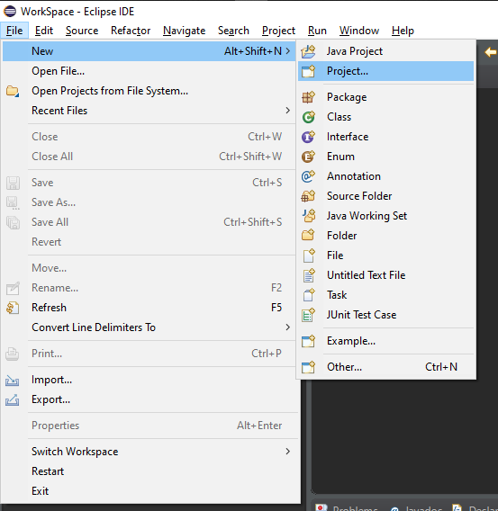
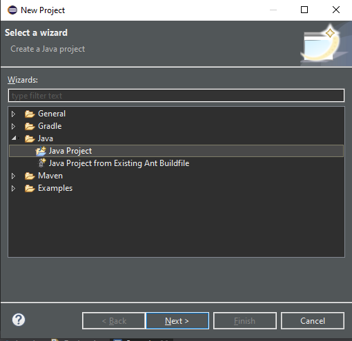
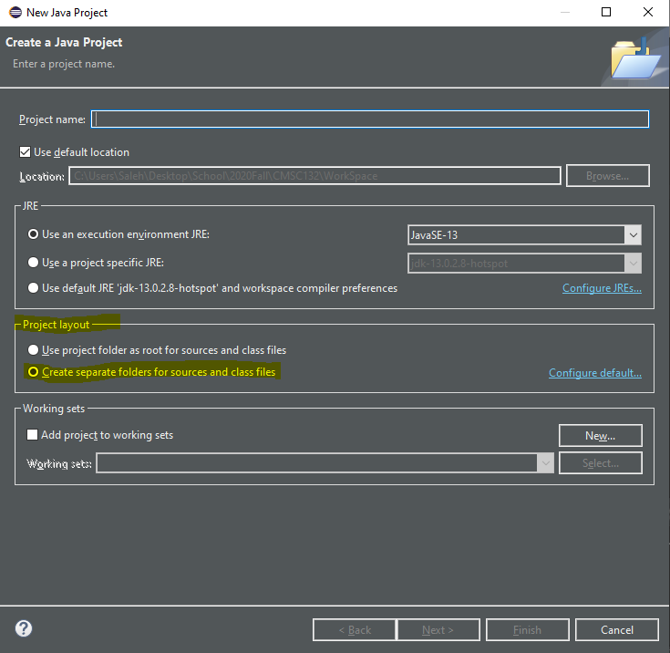
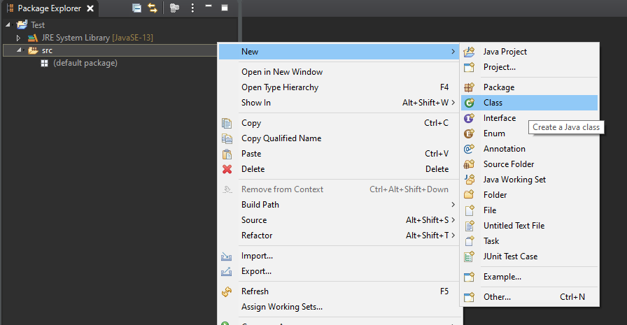
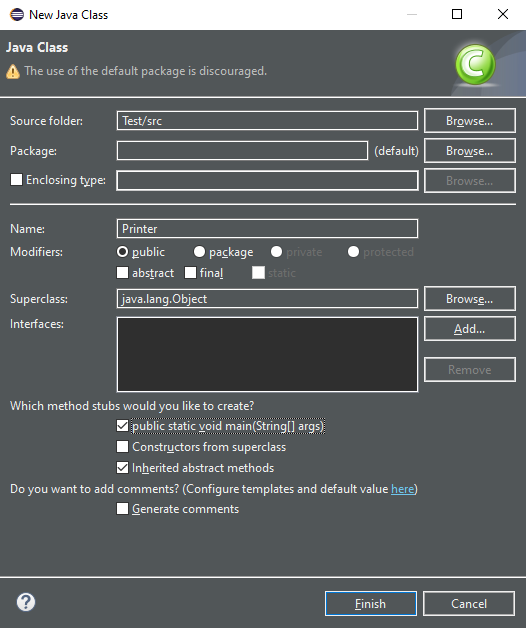
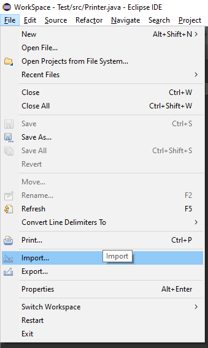
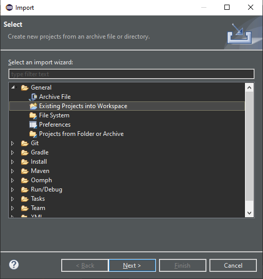
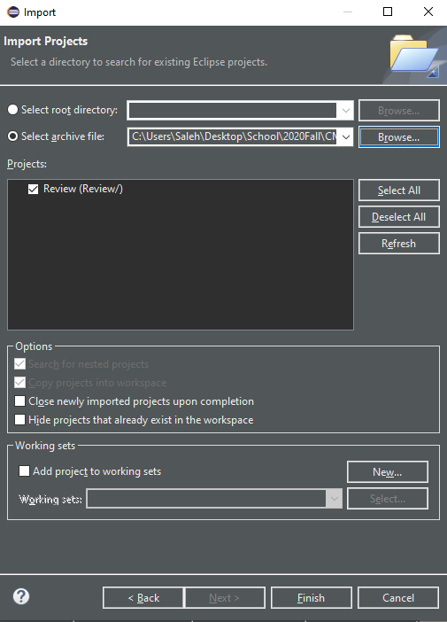
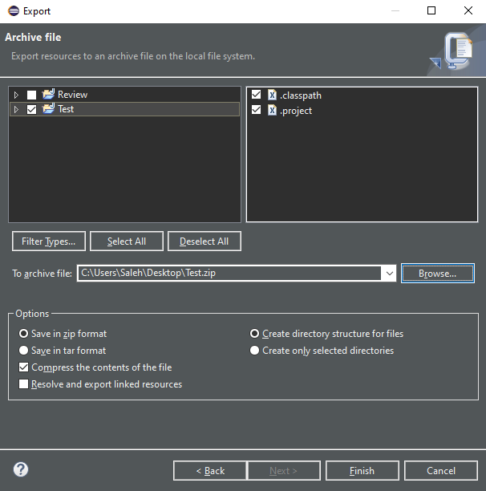

9/1 Intro/Using Eclipse
=======================

About me
^^^^^^^^
My name is Seyed Mohammad Ghaemi and I am junior majoring in computer science: machine learning.
You can contact me through email with sghaemi1@umd[DOT]edu.
I enjoy programming Hollow Knight mods and `have previously helped make tutorials for it too <https://radiance.host/apidocs/>`_.

Class Structure
^^^^^^^^^^^^^^^
I will briefly go over the different components of this class. 
For a more in-depth look, `check out the class site here <https://www.cs.umd.edu/class/fall2021/cmsc132-030X/>`_.

Lectures and Discussions
~~~~~~~~~~~~~~~~~~~~~~~~
Lectures occur in-person on Mondays, Wednesdays, and Fridays in CSI 1115. The class's main topics will be taught through lectures. 

Discussions (or labs) are on Mondays and Wednesdays. Discussions will mainly go over smaller topics and review content taught in lectures. 
If we have extra time before class ends, I will go around helping different people with problems they may be having in the class.   

Exams, Quizzes, and Projects
~~~~~~~~~~~~~~~~~~~~~~~~~~~~
These assignments are open-note and open-book (you can look at slides and old code) but they are not cooperative activties. 
Most of them will involve writing code for a program and sending it to the `submit server for grading <https://submit.cs.umd.edu/>`_. One exception to this is 
the debug quiz (more details on this later). 

Questions
~~~~~~~~~
Ask specific questions relating to code you have written through Office Hours, and general/clarification questions through Piazza.

Using Eclipse
^^^^^^^^^^^^^
You should have the right version of Eclipse and Java installed, if not, `be sure to use the following link to do so <https://www.cs.umd.edu/eclipse/>`_. 

Creating a New Java Project
~~~~~~~~~~~~~~~~~~~~~~~~~~~
In Eclipse, go to File -> New -> Project -> Click on the Java folder -> Java Project

   Figure 1: Screenshot of the new project location. Note that you may be able to choose "Java Project" after choosing "New."

   Figure 2: Screenshot of the page where you get to select a new java project.

Fill in the "Project name" option with whatever name you like. Eclipse gives you the option to decide
if you want your source files (code you write) and class files to be separate through the "Project layout" option. 
We choose to separate the two into different folders by selecting the second option. Click "Finish" to create the new project. 

   Figure 3: The final page for creating a new project.

.. note::
    Eclipse may ask you to create a module (a new feature from Java 13). We will not be covering them in this class
    so if asked choose "Don't create."

Adding a Class to our Project
~~~~~~~~~~~~~~~~~~~~~~~~~~~~~
You can create a class by right-clicking on the "src" folder in the **Package Explorer** and choosing New -> Class. 

   Figure 4: Options you must choose to create a new class.

This will open the **New Java Class** dialogue box. Type in the name of your class in the "Name:" option. 
We will want to select the :code:`public static void main(String args[])` option as well since we want to make a main method. 

   Figure 5: The New Java Class dialogue box.

This is what my class looked like:

.. code-block:: Java

    public class Printer 
    {
        public static void main(String[] args) 
        {
            System.out.println("Hello CMSC132!");
        }
    }

Importing and Exporting Archive files
~~~~~~~~~~~~~~~~~~~~~~~~~~~~~~~~~~~~~
Importing zip files is done to open up example code and coding projects. Exporting is done when you wish to submit 
your code to the submit server.

   Figure 6: Location of Import and Export in the File menu.

Importing
*********
To import, go to File -> Import -> General -> Existing Projects into Workspace -> Select archive File.
I will be importing the **Review.zip** file in the schedule page of the class website.

.. warning::
    Be sure not to choose **Archive File** even though that may sound like the right option. Choose **Existing Projects into Workspace**. 

   Figure 7: The first import dialogue box.

   Figure 8: Choose the **Select archive File** option and browse to your zip file.

Exporting
*********
To export, go to File -> Export -> General -> Archive File

.. figure:: resources/9Ec.PNG
   :scale: 75 %

   Figure 9: Choose **Archive File** in the Export diologue box.

   Figure 10: Select your project then click browse to choose where you want the file to be exported to.

Review
^^^^^^
The rest of this discussion covered the content of the **Review.zip** file. 

Main Method
~~~~~~~~~~~

Conditions and Loops
~~~~~~~~~~~~~~~~~~~~

Classes and Common Methods
~~~~~~~~~~~~~~~~~~~~~~~~~~

Constructors
************

toString()
**********

equals()
********

Static Variables and Methods
~~~~~~~~~~~~~~~~~~~~~~~~~~~~

Mutable vs Immutable
~~~~~~~~~~~~~~~~~~~~

Shallow vs Deep vs Reference Copy
~~~~~~~~~~~~~~~~~~~~~~~~~~~~~~~~~

StringBuffer
~~~~~~~~~~~~

Arrays
~~~~~~

